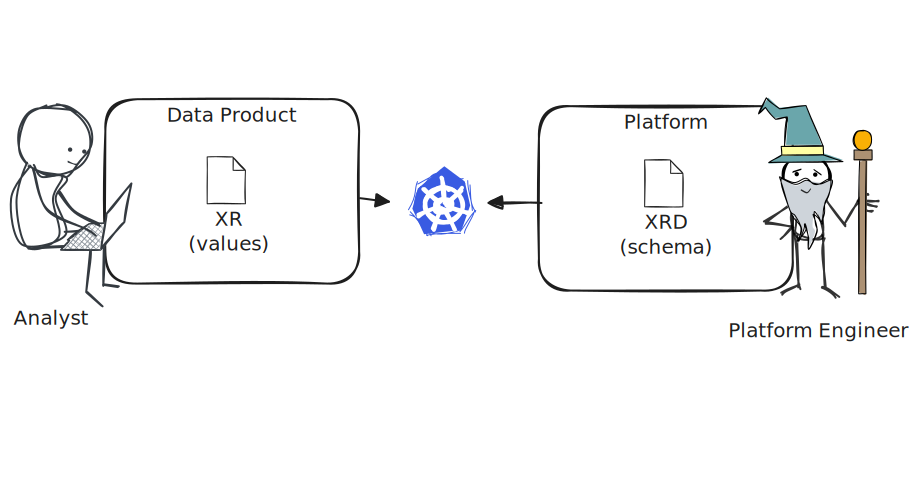

# meshifi infra design

## Context

meshifi is a data mesh implementation based on kubernetes CRDs, which leverages gitops and declarative infrastructure (crossplane) to provision data product components in GCP. The platform could be used as inspiration for an extensible data mesh platform.

## Personas

meshifi is intended to serve a data analyst persona, i.e.

- intimately familiar with SQL
- minimal experience with YAML + Git
- no experience provisioning cloud infrastructure

## Assumptions

- GCP will be used to provision infrastructure
- A service account will be used for all interactions with the source data and destination datasets

## Requirements

The initial implementation will fulfil the following requirements

- Provide a high level abstraction that allows users to provision infrastructure without having to understand complicated YAML files
- Provision a set of GCP datasets to support medallion architecture (raw, cleaned, curated)
- Provision an IAM Service Account with permission to write to these datasets
- Provision an IAM policy to allow a user to impersonate that service account

## Design

We'll start by considering a basic abstraction for the infrastructure. In our first iteration, we want to support the creation of a set of BQ datasets, an IAM service account, and two types IAM policies. A high level overview of what we're trying to achieve is shown below.


### Input Interface

I like to start by considering the user interface that our analyst will see, so let's have a think about that first. By keeping the options in this interface as minimal as possible, at least initially, we'll provide an interface that's both simple for the user, and provides us with room to extend without worrying about loosing "real" user information.

To that end, let's keep it simple - our first interface will look like so:

```yaml
spec:
  info:
    name: some-product
    version: 0.1.0
  access:
    owners:
      - someone@email.com
```

### Composite Resource Definition

Crossplane allows us to capture an input resource like the one above as a "composite resource", but to do this, we need to tell Crossplane what to expect (i.e. the resource schema). Crossplane calls this a Composite Resource Definition or XRD. Our platform (meshifi) defines this schema, and users submit yaml files called Composite Resources that comply with this schema (XRs).



To convert the sample document described above into a Composite Resource Definition (XRD) we need to do two things:

1. Define the schema using OpenAPIV3 (essentially JSONSchema)
2. Provide crossplane with the neccessary details to identify these documents

#### Schema

Our schema will look like so:

```json
{
  "type": "object",
  "properties": {
    "info": {
      "type": "object",
      "properties": {
        "name": {
          "type": "string"
        },
        "version": {
          "type": "string"
        }
      },
      "required": ["name", "version"]
    },
    "access": {
      "type": "object",
      "properties": {
        "owners": {
          "type": "array",
          "items": {
            "type": "string"
          }
        }
      },
      "required": ["owners"]
    }
  },
  "required": ["info", "access"]
}
```

We also need to provide a way for crossplane to identify our resources in the kubernetes cluster, which we'll do by defining an APIGroup and a Kind.

- `group`: a unique domain / namespace under which all our XRDs / schemas will live, e.g. `meshifi.io`
- `lind`: a way to uniquely identify this schema within the API group
- `plural`: how to refer to a collection of these documents
- `version`: a version for the schema, in kubernetes convention (`v1alpha`, `v1beta1`, `v1`, etc.)

For this resource, we'll use the following:

| Property | Value        |
| -------- | ------------ |
| group    | meshifi.io   |
| kind     | DataProduct  |
| plural   | dataproducts |

Putting the above together, our Composite Resource Definition (XRD) looks something like this:

```yaml
apiVersion: apiextensions.crossplane.io/v2
kind: CompositeResourceDefinition
metadata:
  name: dataproducts.meshifi.io
spec:
  scope: Namespaced
  group: meshifi.io
  names:
    kind: DataProduct
    plural: dataproducts
  versions:
    - name: v1alpha1
      served: true
      referenceable: true
      schema:
        openAPIV3Schema:
          type: object
          properties:
            spec:
              type: object
              properties:
                info:
                  type: object
                  properties:
                    name:
                      type: string
                    version:
                      type: string
                  required:
                    - name
                    - version
          required:
            - spec
```

### Composition

We need to translate our user intent into GCP resources (primitives), namely:

- 3x BigQuery Datasets (raw, cleaned, curated)
- 1x IAM Service Account
- Wrote permission for the service account to the BQ datasets
- Impersonation permission for the user to impersonate the service account

In Crossplane, this process is referred to as **composition**. Lets define a composition to translate our input resource into a set of output resource:


Looks simple enough, right? Let's see how this looks in Crossplane.

First, we need a little boilerplate:

```yaml
apiVersion: apiextensions.crossplane.io/v1
kind: Composition
metadata:
  name: data-product-composition
spec:
  compositeTypeRef:
    apiVersion: meshifi.io/v1alpha1
    kind: DataProduct
  mode: Pipeline
  pipeline: []
  # TODO:
  # - Create Datasets
  # - Create Service Account
  # - Create Bindings
```

This gives Crossplane

- a way to uniquely identify this business logic (`metadata.name`),
- a way to know what input resource to monitor (our user intent) (`spec.compositeTypeRef`)
- a set of instructions (`spec.pipeline[]`)

Now we'll set up our resource compositions under `spec.pipeline[]`.

First, we'll create our three BigQuery Datasets (raw, cleaned, curated)

```yaml
- step: create-datasets
  functionRef:
    name: crossplane-contrib-function-go-templating
  input:
    apiVersion: gotemplating.fn.crossplane.io/v1beta1
    kind: GoTemplate
    source: Inline
    inline:
      template: |-
        {{- $datasetTypes := list "raw" "cleaned" "curated" }}
        {{- $first := true }}
        {{- range $datasetType := $datasetTypes }}
        {{- if index $.observed.composite.resource.spec.datasets $datasetType }}
        {{- if not $first }}
        ---
        {{- end }}
        {{- $friendlyName := printf "%s_%s" (replace "-" "_" $.observed.composite.resource.metadata.name) $datasetType }}
        apiVersion: bigquery.gcp.m.upbound.io/v1beta1
        kind: Dataset
        metadata:
          name: "{{ $.observed.composite.resource.metadata.name }}-{{ $datasetType }}"
          namespace: "{{ $.observed.composite.resource.metadata.namespace }}"
          annotations:
            gotemplating.fn.crossplane.io/composition-resource-name: dataset-{{ $datasetType }}
            crossplane.io/external-name: "{{ $friendlyName }}"
            # gotemplating.fn.crossplane.io/ready: "True"
          labels:
            example.crossplane.io/app: "{{ $.observed.composite.resource.metadata.name }}"
        spec:
          providerConfigRef:
            kind: ProviderConfig
            name: default
          forProvider:
            project: meshifi-platform
            location: australia-southeast1
            friendlyName: {{ $friendlyName }}
        {{- $first = false }}
        {{- end }}
        {{- end }}
```

Now we'll create our service account and bindings to allow it to access the datsets:

```yaml
- step: create-sa-and-bindings
  functionRef:
    name: crossplane-contrib-function-go-templating
  input:
    apiVersion: gotemplating.fn.crossplane.io/v1beta1
    kind: GoTemplate
    source: Inline
    inline:
      template: |-
        {{- $serviceAccountName := printf "%s-sa" (replace "_" "-" $.observed.composite.resource.metadata.name) }}
        apiVersion: cloudplatform.gcp.m.upbound.io/v1beta1
        kind: ServiceAccount
        metadata:
          name: some-sa
          namespace: "{{ $.observed.composite.resource.metadata.namespace }}"
          annotations:
            gotemplating.fn.crossplane.io/composition-resource-name: data-product-sa
            gotemplating.fn.crossplane.io/ready: "True"
          labels:
            meshifi.io/data-product: "{{ $.observed.composite.resource.metadata.name }}"
        spec:
          forProvider:
            project: meshifi-platform
            description: "Service account for data product {{ $.observed.composite.resource.metadata.name }}"
          providerConfigRef:
            name: default
            kind: ProviderConfig

        ---
        {{- $datasetTypes := list "raw" "cleaned" "curated" }}
        {{- $first := true }}
        {{- range $datasetType := $datasetTypes }}
        {{- if index $.observed.composite.resource.spec.datasets $datasetType }}
        {{- if not $first }}
        ---
        {{- end }}
        {{- $first = false }}
        apiVersion: bigquery.gcp.m.upbound.io/v1beta1
        kind: DatasetIAMMember
        metadata:
          name: "{{ $.observed.composite.resource.metadata.name }}-{{ $datasetType }}-iam"
          namespace: "{{ $.observed.composite.resource.metadata.namespace }}"
          annotations:
            gotemplating.fn.crossplane.io/composition-resource-name: dataset-{{ $datasetType }}-iam
          labels:
            example.crossplane.io/app: "{{ $.observed.composite.resource.metadata.name }}"
        spec:
          providerConfigRef:
            kind: ProviderConfig
            name: default
          forProvider:
            project: meshifi-platform
            datasetIdRef:
              name: "{{ $.observed.composite.resource.metadata.name }}-{{ $datasetType }}"
            role: roles/bigquery.dataEditor
            member: serviceAccount:{{ $.observed.composite.resource.spec.serviceAccountEmail }}
        {{- end }}
        {{- end }}
```

Finally, we'll ask crossplane to monitor the composed resources for readiness, so that we can provide feedback to the user when all resources are successfully provisioned.

```yaml
- step: automatically-detect-readiness
  functionRef:
    name: crossplane-contrib-function-auto-ready
```

For a comlete example, refer to [Data Product](https://github.com/jkairys/meshifi/blob/main/platform/core/compositions/v1alpha1-data-product.yaml) example in the the github repository.
